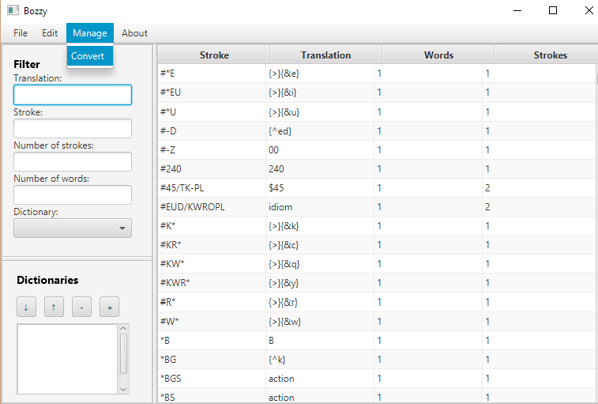

# Analysis Report Template

## Background

This document is an analysis report for project Bozzy, a stenography dictionary editor system that will be built for a final study year software project. A team of four students have taken on this project with the objective of making Plover's JSON dictionary format interoperable with the industry standard of RTF/CRE and to allow users of Plover and also proprietary stenography systems to edit their dictionaries for free. The point of this document is to capture the requirements of Bozzy as they will be the basis of the agreement between our team members and Mirabai Knight, the creator of Plover. This document is also intended to explain how we plan to address these requirements and will act as a reference for our project and team going forward.

## Requirements

### Functional Requirements:

|           |                                                                    |
|-----------|--------------------------------------------------------------------|
|FR 1.1     |The system shall enable the user to add a dictionary.               |                 
|FR 1.2     |The system shall add the dictionary to the list of dictionaries.    |                 
|FR 1.3     |The system shall add the corresponding dictionary entries to the main table.|         
|           |                                                                    |                 
|FR 2.1     |The system shall enable the user to remove a dictionary.            |                 
|FR 2.2     |The system shall display a dialog window to ask if the user wants to remove the dictionary.|
|FR 2.3     |The system shall remove the dictionary from the list of dictionaries|                 
|FR 2.4     |The system shall remove the corresponding dictionary entries from the main table|     
|           |                                                                    |                 
|FR 3.1     |The system shall assign a default priority of n to the newly added dictionary.   n represents the nth dictionary added to the editor. Newly added dictionaries will be by default lowest priority.|
|FR 3.2     |The system shall adjust the priorities of the dictionaries with a lower priority when a dictionary is removed.|
|FR 3.3     |The system shall enable users to change the priority of the dictionaries.|            
|           |                                                                    |
|FR 4.1     |The system shall filter the main table by translation.              |
|FR 4.2     |The system shall filter the main table by stroke.                   |
|           |                                                                    |
|FR 5.1     |The system shall sort the dictionaries by translation.              |
|FR 5.2     |The system shall sort the dictionaries by stroke.                   |
|FR 6.1     |The system shall display changes which have been made to the dictionary. |
|FR 6.2     |The system shall save changes.                                      |
|FR 6.3     |The system shall back up the selected dictionary to the selected directory.|
|FR 6.4     |The system shall back up all of the dictionaries to the selected directory.|
|           |                                                                    |
|FR 7.1     |The system shall convert the dictionary format from RTF to JSON.    |
|FR 7.2     |The system shall convert the dictionary format of JSON to RTF.      |
|           |                                                                    |
|FR 8.1     |The system shall accept a URL to build a dictionary.                |
|FR 8.2     |The system shall accept a block of text to build a dictionary.      |
|FR 8.3     |The system shall scan the text of the URL page for all words currently not in the dictionary.|
|FR 8.4     |The system shall scan the block of text for all words currently not in the dictionary.|
|FR 8.5     |The system shall display a list of words to add to the current dictionary.|
|FR 8.6     |The system shall add the new word to the dictionary.                |

### Non-Functional Requirements

| NFR1 | The system must be able to load several thousand dictionary entries (less than 200,000) and display these entries in a table within 1-5 seconds. |
|------|--------------------------------------------------------------------------------------------------------------------------------------------------|
| NFR2 | The system must be usable for novice stenography users and shall take no longer than 3 hours to learn the basic functionalities.|                |
| NFR3 | The systems reliability for backing up each dictionary must be 95% at a later point in the products life cycle.                                  |
| NFR4 | The system must be maintainable for future use in the Open Steno Project community.                                                              |
| NFR5 | The system must be interoperable between Plover's JSON dictionary formats and the industry standard of RTF/CRE.                                  |
| NFR6 | The system must be expandable for future use in the Open Steno Project community.                                                                |
| NFR7 | The system must be portable on Windows and Mac operating systems.                                                                                |

## Example Data and Test Cases

### Example Data

The data we will be using to test and verify the system are the following dictionaries:

#### `stened.rtf`

A dictionary provided by our customer in RTF format, which the Plover dictionary was originally converted from.

#### `magnum.rtf`

A proprietary dictionary that is sold online, which we have a copy of.

#### `main.json`

The Plover's main dictionary, an source dictionary in JSON format. This dictionary includes 142,664 dictionary entries. Sample data of the first few entries:

```json
{
"#*E": "{>}{&e}",
"#*EU": "{>}{&i}",
"#*U": "{>}{&u}",
"#-D": "{^ed}",
"#-Z": "00",
"#240": "240",
"#45/TK-PL": "$45",
"#EUD/KWROPL": "idiom",
"#K*": "{>}{&k}",
"#KR*": "{>}{&c}",
"#KW*": "{>}{&q}",
"#KWR*": "{>}{&y}",
"#R*": "{>}{&r}",
"#W*": "{>}{&w}",
"*B": "B",
"*BG": "{^k}",
"*BGS": "action",
"*BS": "action",
"*D": "{^'d}",
"*E": "{>}{&e}",
"*E/KHREUPS": "Eclipse"
}
```

### `commands.json`

Plover has "commands" to let the user interact with the system more like a real keyboard, with shortcuts and special keys. Because traditional steno software doesn't emulate a keyboard, this will be a large difference with potentially no conversion possible.

Some sample commands:

```json
{
"PW*FP": "{#BackSpace}",
"SR-RS": "{#Control_L(End)}{^}",
"STPH-B": "{#Down}{^}",
"TPEFBG": "{#Escape}",
"STPH-R": "{#Left}{^}",
"SKWRAURBGS": "{#Return}{#Return}{^}{-|}",
"R-R": "{#Return}{^}"
}
```

### Test Cases

#### Add dictionary scenario

**The user launches the application.**

- The main window appears.

**The user clicks the add dictionary icon from the main window.**

- The add dictionary window appears.

**The user clicks browse in the add dictionary window.**

- The file directory window appears.

**The user navigates through the file directory and selects the plover default dictionary `main.json` from files.**

- The directory for `main.json` file is shown in text box.

**The user clicks okay in the add dictionary window.**

- The table in the center pane of the main window is populated with all `main.json` entries:

| Stroke       | Translation | Words | Strokes |
|--------------|-------------|-------|---------|
| #*E          | {>}{&e}     | 1     | 1       |
| #*EU         | {>}{&i}     | 1     | 1       |
| #*U          | {>}{&u}     | 1     | 1       |
|      ...     |     ...     |  ...  |   ...   |
| PHOUPB/TAPBS | mountains   | 1     | 2       |
| PHOUPB/TEUPB | mountain    | 1     | 2       |
|      ...     |     ...     |  ...  |   ...   |
| WUT          | but         | 1     | 1       |
| WUZ          | was         | 1     | 1       |
| WUZ/KWREU    | wuzzy       | 1     | 2       |


#### Convert dictionary scenario

**The user selects `Manage > Convert` from menu.**

- The convert dictionary window appears.

**The user sets the following convert properties in the convert dictionary window.**

- Select dictionary to convert: `main.json`
- Converting to: `RTF`
- Output Location: `C:\Documents\Dictionaries`

**The users clicks convert in the convert dictionary window.**

- The file system window appears at the directory location of the converted dictionary

> `C:\Documents\Dictionaries\main.rtf`

#### Edit Dictionary + See changes on save scenario

**From the main window's center pane, the user selects an existing dictionary entry from the table**

- The entry becomes editable after selection

| Stroke       | Translation | Words | Strokes |
|--------------|-------------|-------|---------|
| PHOUPB/TAPBS | `mountains` | 1     | 2       |

**The user changes text 'mountains' to 'mountainous' and hits enter or clicks away from the dictionary entry**

- The entry is updated to the changed text

| Stroke       | Translation | Words | Strokes |
|--------------|-------------|-------|---------|
| PHOUPB/TAPBS |`mountainous`| 1     | 2       |

**The user selects `File > Save` from menu.**

- The Save window appears and the following information is displayed:

> Changes made since last save:
> - modified: main.json
> - + PHOUPB/TAPBS , mountainous,  1, 2
> - - PHOUPB/TAPBS , mountains,  1, 2

**The user clicks save**

- Changes are saved to dictionary.

## Use Case Model or Functional Features of System (2-3 paragraphs per feature or use case)

Define WHAT functionality the system will provide. Ideally this would be organized around the major use cases the system would support. This can also be organized around the major functions or features of the system. In either case, your system should have somewhere in the range of 3-10 of these use cases or major features. Include an updated use case diagram.

For each use case or feature:

Identify the requirements that are addressed by it, the actors it is relevant to, and any preconditions or restrictions.

Define clearly the "normal" flow of interactions with the system. Identify the variations on this normal flow that are possible, and in particular what "exceptions" must be handled.

Illustrate the normal flow (and variations) with an example using the sample data from one or more of your critical scenarios. (If the illustration will be shown in your user interface mockups, simply reference which screen shot should be looked at)

## Non-Functional Features

Each non-functional requirement includes a brief description as well an explanation of how we plan to design and build the system to address the requirement, and how we plan to verify that the requirement is met. The non-functional requirements are broken up into 3 classifications; performance, design, and adaption.

### Performance

#### NFR1: The system must be able to load several thousand dictionary entries (less than 200,000) and display these entries in a table within 1-5 seconds.

To address this requirement, we plan to design and build our system using MVC pattern with JavaFx collection of observable lists and table views. We will test and verify this requirement is met by doing manual tests of loading dictionaries and doing direct measurement of time. The largest dictionary we will use as our data to test and verify this requirement has roughly 140,000 dictionary entries, which is a very large number of entries compared to typical dictionaries.

#### NFR2: The system must be usable for novice stenography users and shall take no longer than 3 hours to learn the basic functionalities.

Learning stenography is often overwhelming for new users, and can continue to be challenging for experienced users. Thus the usability of the system is key to attract new users to stenography and to keep existing stenography users engaged. To address this requirement, we have done the following to make design decisions:
- Our customer has sent out a questionnaire to many users who are part of the stenography open source community. The question poses questions about the type of functionality our users would be most interested in
- For each system functionality, each team member brainstorms different UI design ideas, and later we compare ideas and pick or combine the best solution. Even after picking a solution, we continue to be critical of design decisions as our system grows
- We take advantage of asking our customer for design ideas, since she has lots of experience with existing design implementations of stenography and dictionary applications, and always has interesting insight and ideas to offer to improve our design
To test and verify our design, we've gathered both a small group of extremely experienced stenographers, as well as a large pool of stenographers with varying skills from the stenography open source community who've agreed to interact with our system and provide feedback.

#### NFR3: The systems reliability for backing up each dictionary must be 95% at a later point in the systems life cycle.

The system must copy and archive data to users computers in order to recover data after a data loss event, or to recover data from an earlier time. To design and build the system to address this requirement we will copy and archive data to at least 2 file locations every time there is a change made to the dictionary such as add, remove, and modify. To verify the requirement is met, we will use probabilistic measures, such as the model of failure represented by the exponential failure function. We know that the failure intensity is initially high as it would be in new software, since failures are detected more frequently during the testing phase. However, the number of failures would be expected to decrease with
time during the operating phase, presumably as failures are uncovered and repaired. We also know that the more dictionaries a user is modifying at one time in the application, the worse the systems reliability becomes at one time.

### Design

#### NFR4: The system must be maintainable for future use in the Open Steno Project community.

One of the big issues in open source projects is lack of documentation, which discourages people from continuing work on a project since so much effort is needed to understand the application. To design and build the system to address this requirement, we've set up a GitHub repository to keep track of documentation, issues, pull requests, and commits. To verify the requirement is met, developers will keep track of whether the system is easy to repair using anecdotal observation of resources spent.

### Adaption

#### NFR5: The system must be interoperable between Plover's JSON dictionary formats and the industry standard of RTF/CRE.

#### NFR6: The system must be expandable for future use in the Open Steno Project community.

This application must be expandable because after the capstone project, the application will be integrated into the Open Steno Project group who will maintain and continue expanding and adding features to the application. To design and build the system to address this requirement, we will use functional programming to and try to keep our implementations simple and readable with as little code necessary. We will also take into account design principles such as MVC, and use separation of concerns for each module. To verify the requirement is met, expandability will be measured in terms of compliance with open system standards.

#### NFR7: The system must be portable on Windows and Mac operatinos systems.

Our application will have cross-platform support. We are committing to Windows and Mac since these are the two most common platforms our users use. It is really key that our application is portable, because if not it would mean we would be going backwards from dictionary editing solutions that already exist. To design and build the system to address this requirement and allow for cross-platform support, the application will be built to run in the JVM. To verify testing, we will
commit to test on the latest Java 7 CPU update, which at the time of writing is Java 7u79. We will be developing and building in the latest JDK 8, unless for some reason there is some kind of incompatibility introduced into the JDK. Two of our team members will test using have using laptops with Windows 7 OS installed, and our other two team members will test using laptops with Mac OS installed.

## High Level Architecture (2-3 Pages)


Bozzy's overall architecture is best described as a version of the Model View Controller architectural pattern. Bozzy is a standalone desktop application, and the MVC pattern applies quite nicely, and makes it rather trivial to maintain a modularity and separation of concerns within the application.

### User Interface

The user interface will be built using JavaFX and FXML for a modular component-based view layer. Its main role is to enable the user to cleanly view the contents of the user's stenography dictionaries, and access Bozzy's core functions to perform dictionary management tasks. The use of JavaFX for the user interface introduces a dependency to Java and the JVM, though it also enables a the possibility for a seamless experience across multiple operating systems. The user interface will not be modifying the data models directly and will instead communicate with the controllers to perform any actions. Similarly, it should not be getting any core data from the controller, and instead will display information found in the corresponding data model.

### Scala Controllers

The controllers are to be written using Scala. These are what the user (through the user interface) to actually manage and edit their stenography dictionaries.

### Data Models

Data models are used to hold the current dictionary, user settings, and any other data in memory. Keeping the data layer separate from the application logic and views user views makes everything much easier to reason about. It also makes it easier to optimize the data structures as needed, and modify the underlying data schemas without needing to change the way the application uses it.

### Native File System

Bozzy needs to use the operating system's native file system to read and write dictionary files, as well as user settings files. The dictionary files will be stored in JSON as well as RTF/CRE format. The user setting will be stored in a single file in the YAML format in order to make it possible to back up/export/share settings between different installations.

### Third-party Stenography Software

The system will be interacting with and modifying dictionary files from third-party stenography software but will not be interacting directly with the software itself.

### Interactions

The following interaction diagrams illustrate how the different components interact in the main scenarios.

#### Adding a Dictionary


#### Converting a Dictionary


#### Editing a Dictionary Entry


## User Interface Mockup (2-3 pages)


Screenshot 1: This is first page which will be shown when the application is opened


Screenshot 2: When clicking the "+" icon in the dictionaries panel of the main screen, this Add Dictionary dialog is shown


Screenshot 3: This shows the default Plover dictionary open in Bozzy



Screenshot 4: To convert a dictionary, an action is found under the "Manage" menu


Screenshot 5: The user is presented with a few options for converting a dictionary's format


Screenshot 6: Editing a dictionary entry is simple and can be done inline by double-clicking on an entry

## File Formats (1 page)

First, the actual dictionaries managed by Bozzy can be stored in both RTF/CRE format as well as a flat JSON file.

The JSON format is quite simple as it is a standard JSON format, with the restriction that there are no arrays or nested objects. The key represents the stroke (raw input), and the value is the translation (what it should be interpreted as). Here is an example of a simple dictionary, build from an excerpt of the default Plover dictionary:

```json
{
  "*ED": "Ed",
  "*ED/PHA/PHAEU": "edamame",
  "*ED/PHAPL/PHAEU": "edamame",
  "*ED/PHOPB/TO*PB": "Edmonton",
  "*ED/SO*PB": "Edison",
  "*ED/TKA": "Edda",
  "*ED/WARD": "Edward"
}
```

The RTF/CRE format is used by all proprietary stenography software for import/export. It is not as easily human readable as JSON. It also supports some additional fields to provide metadata information on a dictionary entry. Seeing as the JSON format doesn't support these extra fields, however, the conversion between the two formats will not take these into account. Here is an excerpt from a RTF/CRE dictionary:

```rtf
{\*\cxs PHOPB/OG/PHOUS}monogamous
{\*\cxs PRAO*UF/PWHREU}provably
{\*\cxs TKAB/-BLG}dabbling
{\*\cxs HRAEU/PERS/O*PB}layperson
{\*\cxs AEU/PAEL/-BL}appealable
{\*\cxs SREPB/TREUBG/-L}ventricle
{\*\cxs PW*EU/PART/SA*PB/SHEUP}bipartisanship`
```

Finally, some of the user settings will be saved in a single YAML file. This way, users will be able to back up their settings and copy them from one installation to another if needed. This would also allows us to potentially offer ways of backing up/sharing these settings easily.

## Algorithms (2-3 paragraphs per algorithm)

If your system will be dependent on any significant algorithms (pattern recognition, image processing, game strategy, matching problem etc.) then identify them here. Briefly outline the problem that needs to be solved, the alternatives considered, and the algorithm selected. Illustrate the algorithm with an example using the example data.
